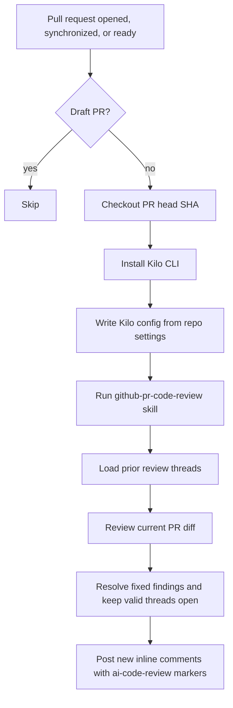

# Code Reviewer Flow

A portable GitHub Actions workflow for AI-assisted pull request review. It runs Kilo Code CLI against each non-draft PR, reconciles prior inline review threads, resolves fixed findings, and posts one inline thread per new finding.

The flow is provider-neutral. Bring your own Kilo model/provider config for OpenAI, Anthropic, Grok/xAI, Composer 2.5, or another provider supported by Kilo.

## What It Includes

- `.github/workflows/code-review.yml`: GitHub Actions workflow for PR review.
- `skills/code-reviewer/SKILL.md`: General review priorities, checklist, and output format.
- `skills/github-pr-code-review/SKILL.md`: GitHub PR orchestration, thread reconciliation, and inline comment posting rules.
- `LICENSE`: MIT license.

## How It Works



Each finding receives a stable marker:

```text
<!-- ai-code-review: <marker_id> -->
```

On later pushes, the workflow uses those markers to avoid duplicate threads and to resolve findings that no longer apply.

## Installation

1. Copy these files into the root of the repository you want reviewed:

```text
.github/workflows/code-review.yml
skills/code-reviewer/SKILL.md
skills/github-pr-code-review/SKILL.md
```

2. Configure GitHub Actions settings:

- Repository variable `KILO_MODEL`: the Kilo model id to run, such as `cursor/composer-2.5`.
- Repository secret `KILO_PROVIDER_CONFIG_JSON`: a JSON object for the Kilo `provider` config.
- Provider API key secret referenced by that provider config, such as `CURSOR_API_KEY`, `OPENAI_API_KEY`, `ANTHROPIC_API_KEY`, or `XAI_API_KEY`.

3. Confirm workflow permissions allow PR comments:

```yaml
permissions:
  contents: read
  pull-requests: write
  issues: write
```

## Provider Examples

These examples are intentionally not defaults. Pick one provider, set `KILO_MODEL`, add the matching API key secret, then store the provider JSON as the `KILO_PROVIDER_CONFIG_JSON` secret.

### OpenAI

Set repository variable:

```text
KILO_MODEL=openai/gpt-5.4-mini
```

Set repository secret `OPENAI_API_KEY`, then set `KILO_PROVIDER_CONFIG_JSON` to:

```json
{
  "openai": {
    "name": "OpenAI",
    "npm": "@ai-sdk/openai",
    "options": {
      "apiKey": "{env:OPENAI_API_KEY}"
    },
    "models": {
      "gpt-5.4-mini": {
        "name": "GPT-5.4 Mini",
        "tool_call": true
      }
    }
  }
}
```

### Claude / Anthropic

Set repository variable:

```text
KILO_MODEL=anthropic/claude-sonnet-4-5
```

Set repository secret `ANTHROPIC_API_KEY`, then set `KILO_PROVIDER_CONFIG_JSON` to:

```json
{
  "anthropic": {
    "name": "Anthropic",
    "npm": "@ai-sdk/anthropic",
    "options": {
      "apiKey": "{env:ANTHROPIC_API_KEY}"
    },
    "models": {
      "claude-sonnet-4-5": {
        "name": "Claude Sonnet 4.5",
        "tool_call": true
      }
    }
  }
}
```

### Grok / xAI

Set repository variable:

```text
KILO_MODEL=xai/grok-build-0.1
```

Set repository secret `XAI_API_KEY`, then set `KILO_PROVIDER_CONFIG_JSON` to:

```json
{
  "xai": {
    "name": "xAI",
    "npm": "@ai-sdk/openai",
    "options": {
      "baseURL": "https://api.x.ai/v1",
      "apiKey": "{env:XAI_API_KEY}"
    },
    "models": {
      "grok-build-0.1": {
        "name": "Grok Build 0.1",
        "tool_call": true
      }
    }
  }
}
```

### Cursor Composer 2.5 (via Standard Agents)

Set repository variable:

```text
KILO_MODEL=cursor/composer-2.5
```

Set repository secret `CURSOR_API_KEY`, then set `KILO_PROVIDER_CONFIG_JSON` to:

```json
{
  "cursor": {
    "name": "Cursor API via Standard Agents",
    "npm": "@ai-sdk/openai-compatible",
    "options": {
      "baseURL": "https://api-for-cursor.standardagents.ai/opencode/v1",
      "apiKey": "{env:CURSOR_API_KEY}"
    },
    "models": {
      "composer-2.5": {
        "name": "Cursor 2.5",
        "cost": {
          "input": 0.5,
          "output": 2.5
        },
        "limit": {
          "context": 200000,
          "output": 65536
        }
      }
    }
  }
}
```

## Validation Checklist

Use a test PR before enabling this broadly:

1. Open a PR with an intentional issue and confirm the bot posts one inline thread per finding.
2. Confirm each bot comment contains an `ai-code-review` marker.
3. Push a fix and confirm the old thread is resolved, not duplicated.
4. Push another commit and confirm new findings are limited to the latest changed lines after the first review.
5. Push with no issues and confirm the workflow does not repeatedly post "no issues found" comments.

## Limitations

- The reviewer can miss issues and can produce false positives; keep human review in the loop.
- The workflow only comments on lines that GitHub allows inline PR comments to target.
- The workflow is prompt-driven and does not include unit tests for the review logic.
- The workflow intentionally does not approve, request changes, merge, push commits, or edit files.
- Expensive test suites are skipped by default; the reviewer may run only read-only checks when useful.

## Not Included

This bundle intentionally excludes app-specific CI validation, deployment automation, secret management, application databases, telemetry pipelines, and internal repository setup. Keep those concerns in your own repository-specific docs or workflows.
